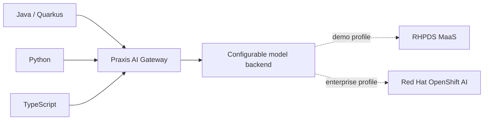

# Govern AI Model Access with Praxis

Give application teams one stable, governed interface for AI models while platform teams control backend endpoints, credentials, and routing. This test-first reference runs Praxis AI Gateway on Red Hat OpenShift and demonstrates the same request from Java, Python, and TypeScript.

> **Important:** RHPDS Model-as-a-Service (MaaS) supplies model access because shared demo environments need a practical model source. MaaS is not presented as a Praxis dependency or the recommended production model-serving architecture. Red Hat OpenShift AI or another compatible endpoint can satisfy the same backend-neutral contract.

## Contents

- [What this demonstrates](#what-this-demonstrates)
- [Architecture](#architecture)
- [Requirements](#requirements)
- [Deploy Track 1](#deploy-track-1)
- [Run the learner UI](#run-the-learner-ui)
- [Validate red and green](#validate-red-and-green)
- [Learning tracks](#learning-tracks)
- [Quality model](#quality-model)
- [Project metadata](#project-metadata)

## What this demonstrates

Application teams commonly embed model URLs, provider credentials, and routing choices in each codebase. Track 1 moves those responsibilities behind Praxis, stores the upstream credential in an OpenShift Secret, and proves that polyglot clients depend only on the gateway contract.

Praxis is an upstream project demonstrated on OpenShift; this repository does not imply Red Hat product support for Praxis. The mock backend makes the first exercise deterministic and consumes no shared model quota. The RHPDS overlay then substitutes provisioned model access without changing learner clients.

## Architecture



Clients receive only `PRAXIS_BASE_URL`. Operators provide `MODEL_BASE_URL`, `PRAXIS_MODEL`, and `MODEL_API_KEY` to deployment automation. The credential is injected at the gateway and must never be exposed to clients, source control, UI evidence, or logs.

## Requirements

The intended runtime is an x86_64/AMD64 OpenShift worker. The pinned Praxis `v0.3.0` image currently publishes an AMD64 manifest, so an Intel or AMD RHPDS cluster is the supported lab target.

Minimum lab environment:

- one OpenShift namespace with permission to create Deployments, Services, Routes, Secrets, ConfigMaps, and NetworkPolicies;
- approximately 2 vCPU and 4 GiB available memory for Track 1;
- `oc`, `python3`, `pip`, and `openssl` on the learner workstation;
- outbound image-pull access to Red Hat's registry and GitHub Container Registry;
- optional Java 17+ and Node.js 20+ for the additional clients.

For local repository checks, install the development dependencies:

```bash
python3 -m pip install -e '.[dev]'
make test-all
```

The standard RHDP Showroom terminal can prepare the complete pinned learner
toolchain without administrator access:

```bash
bash tools/bootstrap_learner.sh
export PATH="$HOME/.local/bin:$PATH"
```

## Deploy Track 1

### Deterministic mock path

```bash
oc new-project praxis-ai-gateway
./runtime-automation/track1/solve.sh
python3 runtime-automation/track1/validate.py
```

The solver generates a lab-only secret, deploys the UBI-based mock backend and Praxis, and waits for both rollouts. The final validator emits machine-readable JSON with `"state": "green"` when the required controls exist.

### RHPDS model-access path

RHPDS provisioning should pass values without displaying or committing them:

```bash
export MODEL_BASE_URL='<provided compatible endpoint>'
export MODEL_API_KEY='<provided virtual key>'
export PRAXIS_MODEL='<provided model name>'
./deploy/rhpds/deploy.sh
```

This overlay removes the mock backend and public Route. An authenticated namespace user connects through OpenShift authorization:

```bash
oc port-forward service/praxis-ai 8080:8080
export PRAXIS_BASE_URL=http://127.0.0.1:8080
python3 clients/python/client.py
```

Run the same request contract from each language:

```bash
python3 clients/python/client.py
mkdir -p /tmp/praxis-java
javac -d /tmp/praxis-java clients/java/src/main/java/com/redhat/praxis/PraxisClient.java
java -cp /tmp/praxis-java com.redhat.praxis.PraxisClient
(cd clients/typescript && npm install && npm run invoke)
```

After completing the exercises, create a sanitized bundle that can be retained
after the ephemeral OpenShift project is removed:

```bash
python3 tools/collect_evidence.py --project praxis-ai-gateway
```

A production exposure requires a separately designed and tested downstream OAuth/OIDC authentication boundary.

## Run the learner UI

The UI makes an otherwise invisible gateway hop understandable and returns evidence for the exact request rather than a potentially unrelated “latest trace.” It never receives the upstream credential.

On OpenShift, obtain its edge-TLS route after deployment:

```bash
oc get route praxis-ui -o jsonpath='https://{.spec.host}{"\n"}'
```

The mock profile exposes only the non-sensitive deterministic backend. The RHPDS profile changes the UI route to re-encrypt TLS and places an OpenShift OAuth proxy in front of Gradio; direct Praxis access remains namespace-authorized only.

For local UI development:

```bash
python3 -m pip install -e '.[ui]'
export PRAXIS_BASE_URL=http://127.0.0.1:8080
python3 src/ui.py
```

Open the printed local URL, submit a prompt, and compare the topology with the returned trace identifier, model, status, and elapsed time. Do not submit sensitive or regulated data to a shared demonstration model.

## Validate red and green

The lab uses a competency-driven red/green loop:

```bash
# Before deployment: exits non-zero and reports state red.
python3 runtime-automation/track1/validate.py

# Apply the minimum solution.
./runtime-automation/track1/solve.sh

# After deployment: exits zero and reports state green.
python3 runtime-automation/track1/validate.py
```

CI also runs the pinned Praxis image natively on AMD64, sends a request through the gateway, proves that Praxis replaces a caller-supplied authorization value with the gateway-owned credential, and checks that the credential does not appear in gateway logs.

To remove the mock exercise:

```bash
oc delete project praxis-ai-gateway
```

## Learning tracks

- **Track 1 — establish governed access (30–45 minutes):** deploy Praxis, connect one backend, invoke it from multiple languages, and prove credential isolation and backend portability.
- **Track 2 — operate a platform capability:** add supported routing, accounting, persistence, correlated observability, failure behavior, and OpenShift GitOps reconciliation.
- **Track 3 — apply governance patterns:** explore tenant isolation, allowlists, controlled egress, data handling, credential rotation, retention, and audit evidence for industry-sensitive scenarios without claiming regulatory compliance.

Track 3 includes a [contract-ready PPE → OCSF → immutable-ledger preview](docs/track3-ppe-ocsf-ledger-preview.md). It keeps PPE in charge of authorization and uses the exact Praxis trace ID to correlate a sanitized decision with a proof receipt. The module remains preview material until a pinned upstream audit interface passes its OpenShift conformance gates.

Track 1 is the standalone technical quickstart candidate. The RHDP Showroom
uses the same implementation as a solution-architect-led customer experience:
the default 20–30 minute path demonstrates governed access and the application
boundary, while operations and governance are optional discussion depths.
Customers do not need access to this private engineering repository to complete
the Showroom journey. See [DESIGN.md](DESIGN.md) and the
[capability matrix](docs/capability-matrix.md) for the staged scope.

## Quality model

Every capability links competency-based training (CBT), contract-driven development (CDD), behavior-driven development (BDD), example-driven development (EDD), and test-driven development (TDD) to a red/green result:

- [validation matrix](tests/validation_matrix.yaml)
- [competency rubric](tests/competency_rubric.yaml)
- [claim registry](tests/claim_registry.yaml)
- [benchmark rubric](tests/benchmark_rubric.yaml)
- [BDD scenarios](features/)
- [architecture decisions](docs/decisions/)
- [upstream evidence review](docs/upstream-evidence.md)

## Project metadata

- **Title:** Govern AI Model Access with Praxis
- **Description:** Deploy a backend-neutral Praxis AI Gateway pattern on Red Hat OpenShift and verify it with polyglot clients.
- **Industry:** Media and IT services; optional scenarios for banking, healthcare, government, manufacturing, and telecommunications
- **Product:** Red Hat OpenShift; Red Hat OpenShift AI integration path
- **Use case:** Governed generative AI model access and platform engineering
- **Partner:** Praxis upstream community
- **Contributor organization:** Red Hat

References: [Praxis AI](https://github.com/praxis-proxy/ai), [Praxis demos](https://github.com/praxis-proxy/demos), [Praxis experimental demonstrations](https://github.com/praxis-proxy/experimental), and [Red Hat OpenShift AI documentation](https://docs.redhat.com/en/documentation/red_hat_openshift_ai_self-managed/).

Licensed under the [Apache License 2.0](LICENSE).
