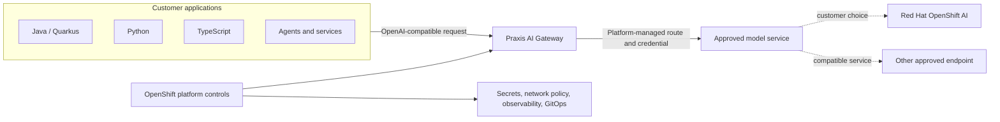

# Govern AI Model Access with Praxis

Praxis gives application teams one consistent way to call approved AI models while a platform team controls model endpoints, credentials, and routing. This reference implementation runs Praxis AI Gateway on Red Hat OpenShift and proves the same application contract from Java, Python, and TypeScript.

Use this repository to evaluate a customer pattern: applications integrate once with an internal AI gateway, and the organization can change the model service behind that gateway without rewriting every application.

## Contents

- [Customer problem](#customer-problem)
- [Architecture](#architecture)
- [How an application uses Praxis](#how-an-application-uses-praxis)
- [How a platform team uses Praxis](#how-a-platform-team-uses-praxis)
- [Customer adoption path](#customer-adoption-path)
- [Requirements](#requirements)
- [Deploy Track 1](#deploy-track-1)
- [Run the learner UI](#run-the-learner-ui)
- [Validate red and green](#validate-red-and-green)
- [Learning tracks](#learning-tracks)
- [Production considerations](#production-considerations)
- [Demo-platform profile](#demo-platform-profile)
- [Project metadata](#project-metadata)

## Customer problem

Without a gateway, each application may carry its own provider URL, model name, credential-handling logic, and routing assumptions. That creates duplicated integration work and makes a model change or credential rotation an application release event.

Praxis establishes a separation of responsibilities:

- application teams call a stable OpenAI-compatible endpoint and a logical model name;
- platform teams select approved model services and manage upstream credentials;
- security and operations teams gain a common control and evidence point;
- the model backend can change while the application-facing contract remains stable.

This repository demonstrates that boundary. Praxis is an upstream project shown running on OpenShift; it is not represented here as a supported Red Hat product.

## Architecture



The application knows the gateway URL and logical model. It does not need the upstream model URL or upstream credential. OpenShift supplies the deployment, secret, networking, and operational boundary around Praxis.

## How an application uses Praxis

An application receives:

- `PRAXIS_BASE_URL`: the customer-managed gateway address;
- `PRAXIS_MODEL`: the logical model name approved for that workload.

It sends a normal chat-completions request:

```bash
curl --fail-with-body "${PRAXIS_BASE_URL}/v1/chat/completions" \
  -H 'Content-Type: application/json' \
  -d "{
    \"model\": \"${PRAXIS_MODEL}\",
    \"messages\": [
      {\"role\": \"user\", \"content\": \"Explain governed AI access in one sentence.\"}
    ]
  }"
```

The repository includes equivalent examples for:

- [Python](clients/python/client.py)
- [Java](clients/java/src/main/java/com/redhat/praxis/PraxisClient.java)
- [TypeScript](clients/typescript/src/client.ts)

Those clients do not contain a model-provider URL or upstream API key. If the platform team changes the approved backend, the client contract remains `PRAXIS_BASE_URL` plus `PRAXIS_MODEL`.

## How a platform team uses Praxis

The platform team owns the backend-facing settings:

- `MODEL_BASE_URL`: the approved OpenAI-compatible model endpoint;
- `MODEL_API_KEY`: the upstream credential, stored in an OpenShift Secret;
- `PRAXIS_MODEL`: the logical model presented to applications.

Praxis routes requests to the approved backend and replaces any caller-supplied upstream authorization value with the gateway-owned credential. The credential must never be committed to source control, returned to clients, placed in UI evidence, or written to logs.

The reference manifests also demonstrate an OpenShift namespace boundary, least-necessary network access, health checks, resource settings, and a non-sensitive proof UI. They are an evaluation baseline, not a complete production security design.

## Customer adoption path

1. **Select one application and one approved model service.** Start with a bounded workload whose expected request and response can be tested.
2. **Deploy Praxis on OpenShift.** Keep the model endpoint and credential under platform-team control.
3. **Change the application connection.** Point its OpenAI-compatible client at `PRAXIS_BASE_URL` and use a logical `PRAXIS_MODEL`.
4. **Prove the boundary.** Verify successful inference, credential isolation, trace correlation, and failure behavior.
5. **Add enterprise controls.** Integrate downstream identity, TLS, policy, rate limits, budgets, observability, GitOps, and lifecycle management according to the customer's requirements.
6. **Onboard additional applications and models.** Reuse the gateway contract instead of recreating provider-specific integration in each codebase.

## Requirements

The evaluation target is Red Hat OpenShift on x86_64/AMD64 workers. The pinned Praxis `v0.3.0` image currently publishes an AMD64 manifest.

Minimum environment:

- one OpenShift namespace with permission to create Deployments, Services, Routes, Secrets, ConfigMaps, and NetworkPolicies;
- approximately 2 vCPU and 4 GiB available memory for Track 1;
- `oc`, `python3`, `pip`, and `openssl` on the workstation;
- outbound image-pull access to Red Hat's registry and GitHub Container Registry;
- optional Java 17+ and Node.js 20+ for the additional clients;
- an approved OpenAI-compatible endpoint for a live-model evaluation.

For repository checks:

```bash
python3 -m pip install -e '.[dev]'
make test-all
```

## Deploy Track 1

Track 1 is a repeatable technical evaluation, not a prescribed production installation. Its deterministic path uses a UBI-based mock model service so teams can first prove the gateway boundary without consuming model quota or sending data to an external model.

```bash
oc new-project praxis-ai-gateway
./runtime-automation/track1/solve.sh
python3 runtime-automation/track1/validate.py
```

The solver creates a lab-only secret, deploys the mock service and Praxis, and waits for both rollouts. The validator returns machine-readable JSON with `"state": "green"` when the expected controls exist.

Connect an application through an authenticated namespace session:

```bash
oc port-forward service/praxis-ai 8080:8080
export PRAXIS_BASE_URL=http://127.0.0.1:8080
export PRAXIS_MODEL=lab-model
python3 clients/python/client.py
```

Run the same contract from all three example clients:

```bash
python3 clients/python/client.py
mkdir -p /tmp/praxis-java
javac -d /tmp/praxis-java clients/java/src/main/java/com/redhat/praxis/PraxisClient.java
java -cp /tmp/praxis-java com.redhat.praxis.PraxisClient
(cd clients/typescript && npm install && npm run invoke)
```

To retain sanitized results after removing the OpenShift project:

```bash
python3 tools/collect_evidence.py --project praxis-ai-gateway
```

## Run the learner UI

The optional UI is a demonstration and workshop aid. It makes the otherwise invisible gateway hop visible and correlates the response with the exact trace identifier, model, status, and elapsed time. It never receives the upstream credential.

After deployment, get its edge-TLS route:

```bash
oc get route praxis-ui -o jsonpath='https://{.spec.host}{"\n"}'
```

For local UI development:

```bash
python3 -m pip install -e '.[ui]'
export PRAXIS_BASE_URL=http://127.0.0.1:8080
export PRAXIS_MODEL=lab-model
python3 src/ui.py
```

Do not submit sensitive, confidential, or regulated data during an evaluation unless the selected model service and environment have been approved for it.

## Validate red and green

The repository uses a competency-driven red/green loop:

```bash
# Before deployment: exits non-zero and reports state red.
python3 runtime-automation/track1/validate.py

# Apply the minimum solution.
./runtime-automation/track1/solve.sh

# After deployment: exits zero and reports state green.
python3 runtime-automation/track1/validate.py
```

CI also starts the pinned Praxis image on AMD64, sends a request through the gateway, proves that Praxis replaces caller-supplied authorization with the gateway-owned credential, and checks that the credential does not appear in gateway logs.

Remove the evaluation environment with:

```bash
oc delete project praxis-ai-gateway
```

## Learning tracks

- **Track 1 — establish governed access (30–45 minutes):** connect an application through Praxis and prove backend portability and credential isolation.
- **Track 2 — operate a platform capability:** add supported routing, accounting, persistence, correlated observability, failure behavior, and OpenShift GitOps reconciliation.
- **Track 3 — apply governance patterns:** explore tenant isolation, allowlists, controlled egress, data handling, credential rotation, retention, and audit evidence for industry-sensitive scenarios without claiming regulatory compliance.

Track 3 includes a [contract-ready PPE → OCSF → immutable-ledger preview](docs/track3-ppe-ocsf-ledger-preview.md). PPE remains responsible for authorization; the pattern uses the Praxis trace ID to correlate a sanitized decision with a proof receipt. It remains preview material until a pinned upstream audit interface passes its OpenShift conformance gates.

The staged scope is documented in [DESIGN.md](DESIGN.md) and the [capability matrix](docs/capability-matrix.md).

## Production considerations

Before production use, a customer architecture should explicitly address:

- downstream OAuth/OIDC authentication and workload identity;
- TLS and certificate lifecycle on both sides of the gateway;
- tenancy, model allowlists, routing policy, quotas, budgets, and rate limits;
- approved data classes, prompt and response handling, and retention;
- audit, metrics, traces, alerts, and incident response;
- secret rotation, configuration promotion, rollback, and disaster recovery;
- image provenance, vulnerability management, support ownership, and Praxis version lifecycle.

Red Hat OpenShift AI can provide the customer-owned model-serving path when it fits the architecture. Another compatible, approved model service can satisfy the same backend-neutral interface.

## Demo-platform profile

Red Hat Demo Platform environments use Model-as-a-Service to provide practical, shared access to models across multiple labs. MaaS is not presented as a Praxis dependency or the recommended production model-serving architecture.

The demo overlay supplies `MODEL_BASE_URL`, `MODEL_API_KEY`, and `PRAXIS_MODEL` during provisioning, removes the deterministic mock, and protects the UI with OpenShift OAuth. Those mechanics exist for the hosted demonstration and are deliberately separated from the customer adoption pattern above.

The Showroom experience is designed for a solution architect to guide a customer through the business problem, application contract, live proof, and optional operations or governance discussions. Customers do not need access to this engineering repository to participate.

## Quality model

Every capability links competency-based training (CBT), contract-driven development (CDD), behavior-driven development (BDD), example-driven development (EDD), and test-driven development (TDD) to a red/green result:

- [validation matrix](tests/validation_matrix.yaml)
- [competency rubric](tests/competency_rubric.yaml)
- [claim registry](tests/claim_registry.yaml)
- [benchmark rubric](tests/benchmark_rubric.yaml)
- [BDD scenarios](features/)
- [architecture decisions](docs/decisions/)
- [upstream evidence review](docs/upstream-evidence.md)

## Project metadata

- **Title:** Govern AI Model Access with Praxis
- **Description:** Deploy a backend-neutral Praxis AI Gateway pattern on Red Hat OpenShift and verify it with polyglot clients.
- **Industry:** Cross-industry; optional scenarios for banking, healthcare, government, manufacturing, media, telecommunications, and IT services
- **Product:** Red Hat OpenShift; Red Hat OpenShift AI integration path
- **Use case:** Governed generative AI model access and platform engineering
- **Partner:** Praxis upstream community
- **Contributor organization:** Red Hat

References: [Praxis AI](https://github.com/praxis-proxy/ai), [Praxis demos](https://github.com/praxis-proxy/demos), [Praxis experimental demonstrations](https://github.com/praxis-proxy/experimental), and [Red Hat OpenShift AI documentation](https://docs.redhat.com/en/documentation/red_hat_openshift_ai_self-managed/).

Licensed under the [Apache License 2.0](LICENSE).
