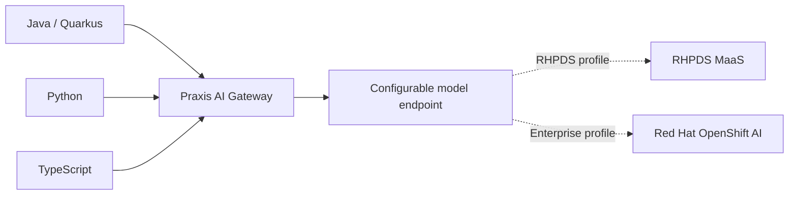

# Govern AI Model Access with Praxis

Provide application teams with consistent, governed access to AI models without embedding provider credentials, endpoints, and routing policy in every application.

This repository is a test-first reference implementation for running Praxis AI Gateway on Red Hat OpenShift. It is intentionally backend-neutral: Red Hat Demo Platform environments can supply a shared Model-as-a-Service (MaaS) endpoint, while other deployments can use Red Hat OpenShift AI model serving or another compatible inference endpoint without changing client code.

## Project status

The repository is currently in its design and contract phase. The failing acceptance scenarios define the behavior that the implementation must satisfy.

## Learning paths

- Track 1: deploy the gateway, connect one model endpoint, and prove polyglot client access.
- Track 2: add routing, accounting, persistence, observability, resilience, and GitOps.
- Track 3: apply governance patterns for regulated and industry-sensitive workloads.

See [DESIGN.md](DESIGN.md) for the complete learning and implementation plan.

## Architecture

The clients know only the Praxis route. The selected backend, model identity, and credential are gateway-side configuration.

## Quality model

The project combines contract-driven, test-driven, example-driven, behavior-driven, and competency-based development. See:

- [Validation matrix](tests/validation_matrix.yaml)
- [Competency rubric](tests/competency_rubric.yaml)
- [BDD scenarios](features/)
- [Architecture decisions](docs/decisions/)

## References

- [Praxis AI](https://github.com/praxis-proxy/ai)
- [Praxis documentation](https://praxis.fast/docs/getting-started/introduction/)
- [Red Hat OpenShift AI documentation](https://docs.redhat.com/en/documentation/red_hat_openshift_ai_self-managed/)

## License

Apache License 2.0. A license file will be added before publication.

